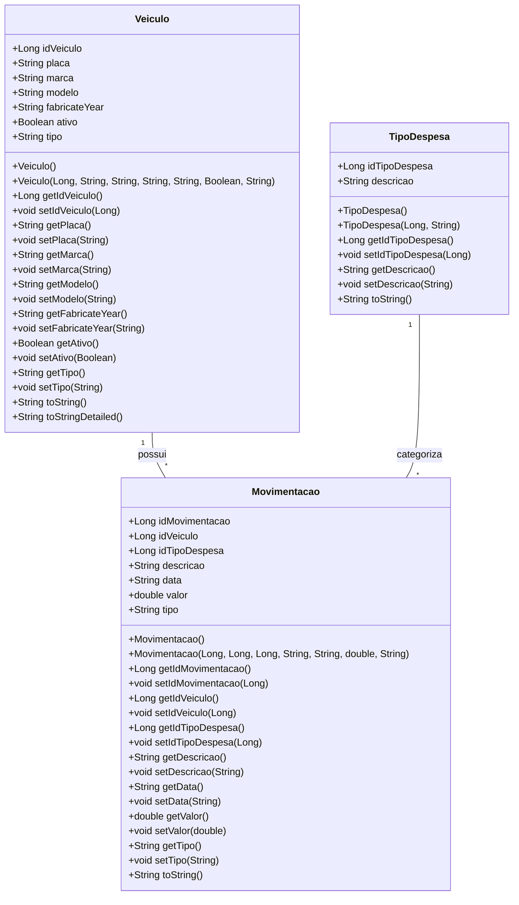
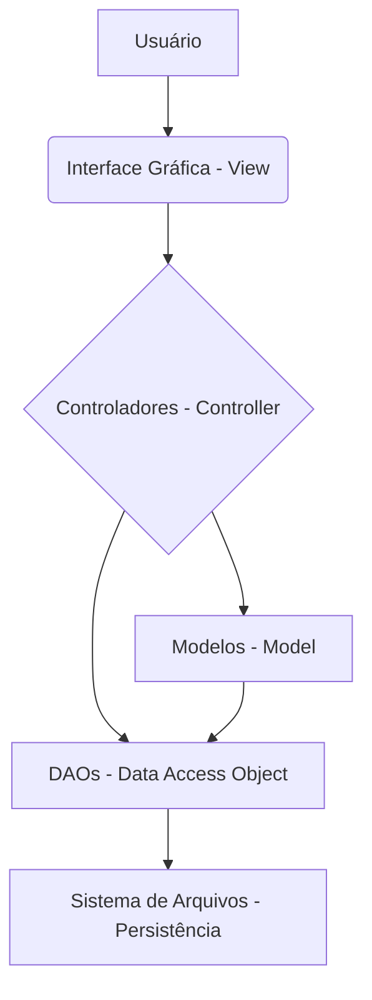

# Projeto - Sistema de Frotas

Sistema Java Swing para controle de gastos de frota veicular, atualizado para o Projeto Integrador 2026/1.

# Gerenciamento de Frotas

Este projeto é um sistema de gerenciamento de frotas desenvolvido em Java, utilizando uma interface gráfica Swing para facilitar o controle e a administração de veículos, movimentações e tipos de despesas. O sistema permite o cadastro, edição, exclusão e visualização de veículos, bem como o registro de movimentações financeiras e a categorização de despesas.

## Funcionalidades

O sistema oferece as seguintes funcionalidades:

*   **Cadastro de Veículos:** Adicionar novos veículos à frota com informações como placa, marca, modelo, ano de fabricação, status (ativo/inativo) e tipo.
*   **Gestão de Movimentações:** Registrar todas as movimentações financeiras relacionadas aos veículos, incluindo descrição, data, valor e tipo de despesa.
*   **Categorização de Despesas:** Gerenciar tipos de despesas para uma organização financeira mais eficiente.
*   **Relatórios:** Gerar relatórios detalhados sobre veículos e movimentações.
*   **Persistência de Dados:** Os dados são armazenados em arquivos de texto simples (`.txt`), simulando um banco de dados para fins de demonstração e aprendizado.

## Tecnologias Utilizadas

*   **Linguagem de Programação:** Java 17
*   **Interface Gráfica:** Swing
*   **Gerenciador de Dependências:** Maven
*   **Persistência de Dados:** Arquivos de texto (.txt)

## Estrutura do Projeto

O projeto segue uma estrutura de pacotes organizada para separar as responsabilidades de cada componente:

```
Sistema-De-Frotas/
├── pom.xml
├── src/
│   ├── main/
│   │   ├── java/
│   │   │   └── br/com/
│   │   │       ├── Main.java
│   │   │       ├── controller/       # Lógica de negócio e manipulação de dados
│   │   │       │   ├── MovimentacaoController.java
│   │   │       │   ├── TipoDespesaController.java
│   │   │       │   ├── RelatoriosController.java
│   │   │       │   └── VeiculoController.java
│   │   │       ├── dao/              # Camada de acesso a dados (Data Access Objects)
│   │   │       │   ├── MovimentacaoDAO.java
│   │   │       │   ├── TipoDespesaDAO.java
│   │   │       │   └── VeiculoDAO.java
│   │   │       ├── model/            # Classes de modelo (entidades de dados)
│   │   │       │   ├── Movimentacao.java
│   │   │       │   ├── TipoDespesa.java
│   │   │       │   ├── Veiculo.java
│   │   │       │   └── VeiculoComboItem.java
│   │   │       ├── ui/               # Componentes de UI personalizados
│   │   │       │   ├── ModernButton.java
│   │   │       │   ├── ModernColors.java
│   │   │       │   ├── ModernComboBox.java
│   │   │       │   ├── ModernInnerTabbedPane.java
│   │   │       │   ├── ModernTabbedPane.java
│   │   │       │   ├── RoundedPanel.java
│   │   │       │   ├── WrapLayout.java
│   │   │       │   └── components/   # Componentes de UI específicos
│   │   │       │       ├── MovementCard.java
│   │   │       │       ├── VehicleCard.java
│   │   │       │       └── VehicleDetailsPanel.java
│   │   │       ├── utils/            # Classes utilitárias
│   │   │       │   ├── GeradorCSV.java
│   │   │       │   ├── IconLoader.java
│   │   │       │   ├── MatrizRelatorios.java
│   │   │       │   └── Validacoes.java
│   │   │       └── view/             # Telas da interface gráfica
│   │   │           ├── MovementFormDialog.java
│   │   │           ├── TelaAbout.java
│   │   │           ├── TelaCadastroDespesa.java
│   │   │           ├── TelaCadastroVeiculo.java
│   │   │           ├── TelaMovimentacao.java
│   │   │           ├── TelaPrincipal.java
│   │   │           └── TelaRelatorios.java
│   │   └── resources/        # Recursos como ícones
│   │       └── icons/
├── dados/                  # Diretório para arquivos de persistência de dados
│   ├── movimentacoes.txt
│   ├── tipos_despesas.txt
│   └── veiculos.txt
└── target/                 # Diretório de saída do Maven
```

## Modelagem de Dados (Diagrama de Classes)

O diagrama de classes a seguir ilustra as principais entidades do sistema e seus relacionamentos, fornecendo uma visão clara da estrutura de dados e como os diferentes componentes interagem.




## Arquitetura do Sistema

O sistema segue o padrão arquitetural Model-View-Controller (MVC), que separa a aplicação em três componentes principais para melhorar a organização do código, a manutenibilidade e a escalabilidade:

*   **Model (Modelo):** Representa os dados e a lógica de negócios. Inclui as classes `Veiculo`, `Movimentacao` e `TipoDespesa`, além das classes DAO (`VeiculoDAO`, `MovimentacaoDAO`, `TipoDespesaDAO`) que gerenciam a persistência dos dados em arquivos.
*   **View (Visão):** Responsável pela apresentação dos dados ao usuário. É composta pelas classes da interface gráfica Swing, como `TelaPrincipal`, `TelaCadastroVeiculo`, `TelaMovimentacao`, etc.
*   **Controller (Controlador):** Atua como intermediário entre o Modelo e a Visão, processando as entradas do usuário, atualizando o Modelo e selecionando a Visão apropriada para exibir os resultados. As classes `VeiculoController`, `MovimentacaoController` e `TipoDespesaController` são exemplos de controladores.




## Como Executar o Projeto

Para executar este projeto localmente, siga os passos abaixo:

### Pré-requisitos

Certifique-se de ter o seguinte software instalado em sua máquina:

*   **Java Development Kit (JDK) 17** ou superior.
*   **Apache Maven** (para gerenciar as dependências e compilar o projeto).

### Passos para Execução

1.  **Clone o Repositório:**

    ```bash
    git clone https://github.com/GilvanPedro/Gerenciamento-de-Frotas.git
    cd Gerenciamento-de-Frotas/Sistema-De-Frotas
    ```

2.  **Compile o Projeto com Maven:**

    ```bash
    mvn clean install
    ```

3.  **Execute a Aplicação:**

    ```bash
    mvn exec:java -Dexec.mainClass="br.com.Main"
    ```

    Alternativamente, você pode executar o arquivo JAR gerado na pasta `target`:

    ```bash
    java -jar target/Sistema-de-Frotas-1.0-SNAPSHOT.jar
    ```

    *Nota: Pode ser necessário ajustar o nome do arquivo JAR se a versão for diferente.*

## Licença

Este projeto está licenciado sob a Licença MIT. Consulte o arquivo [LICENSE](LICENSE) para mais detalhes.

```
MIT License

Copyright (c) 2025 Gilvan Pedro

Permission is hereby granted, free of charge, to any person obtaining a copy
of this software and associated documentation files (the "Software"), to deal
in the Software without restriction, including without limitation the rights
to use, copy, modify, merge, publish, distribute, sublicense, and/or sell
copies of the Software, and to permit persons to whom the Software is
furnished to do so, subject to the following conditions:

The above copyright notice and this permission notice shall be included in all
copies or substantial portions of the Software.

THE SOFTWARE IS PROVIDED "AS IS", WITHOUT WARRANTY OF ANY KIND, EXPRESS OR
IMPLIED, INCLUDING BUT NOT LIMITED TO THE WARRANTIES OF MERCHANTABILITY,
FITNESS FOR A PARTICULAR PURPOSE AND NONINFRINGEMENT. IN NO EVENT SHALL THE
AUTHORS OR COPYRIGHT HOLDERS BE LIABLE FOR ANY CLAIM, DAMAGES OR OTHER
LIABILITY, WHETHER IN AN ACTION OF CONTRACT, TORT OR OTHERWISE, ARISING FROM,
OUT OF OR IN CONNECTION WITH THE SOFTWARE OR THE USE OR OTHER DEALINGS IN THE
SOFTWARE.
```

## Autor

*   **Gilvan Pedro** - [GitHub](https://github.com/GilvanPedro)
