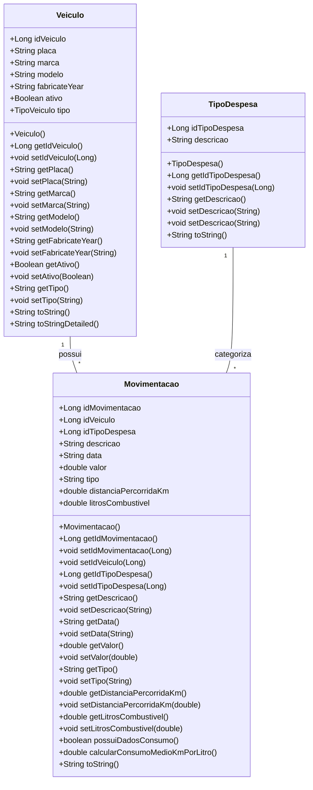
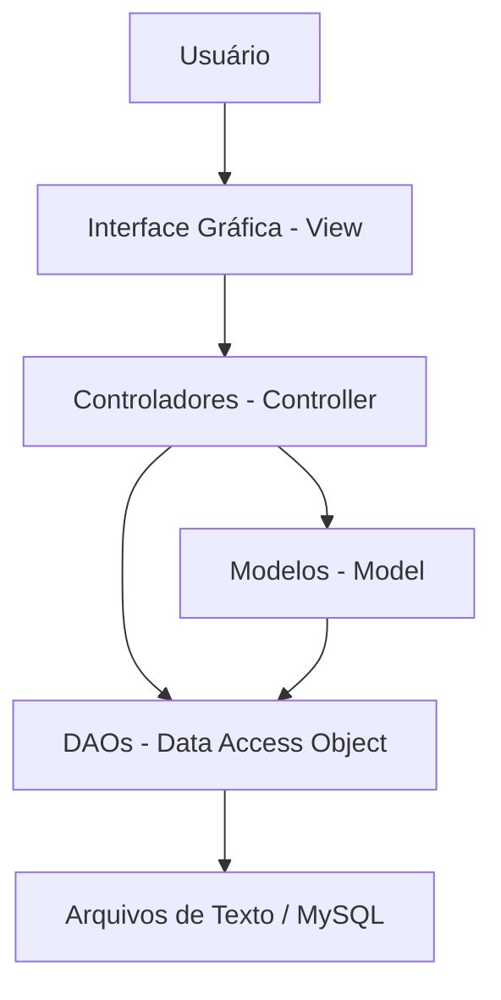

# Projeto - Sistema de Frotas

Sistema Java Swing para controle de gastos de frota veicular, com persistência de dados em arquivos de texto e **sincronização opcional com MySQL**, atualizado para o Projeto Integrador 2026/1.

## Gerenciamento de Frotas - GynLog

Este projeto é um sistema de gerenciamento de frotas desenvolvido em Java, utilizando uma interface gráfica Swing para facilitar o controle e a administração de veículos, movimentações e tipos de despesas. O sistema permite o cadastro, edição, exclusão e visualização de veículos, bem como o registro de movimentações financeiras, a categorização de despesas e a **geração de relatórios detalhados com análises de consumo e custos**.

### Estilo Visual

O sistema possui uma estética visual moderna e intuitiva, com uma aparência que remeta a um programa destinado a uma fazenda, utilizando componentes de UI personalizados para uma experiência de usuário aprimorada.

## Funcionalidades

O sistema oferece as seguintes funcionalidades:

*   **Cadastro de Veículos:** Adicionar novos veículos à frota com informações como placa, marca, modelo, ano de fabricação, status (ativo/inativo) e tipo. Inclui funcionalidades de ordenação por diversos critérios (Marca, Modelo, Placa, Ano de fabricação, Tipo de veículo).
*   **Gestão de Movimentações:** Registrar todas as movimentações financeiras relacionadas aos veículos, incluindo descrição, data, valor, tipo de despesa, **distância percorrida (km) e litros de combustível**, permitindo o cálculo de consumo médio.
*   **Categorização de Despesas:** Gerenciar tipos de despesas para uma organização financeira mais eficiente, com categorias padrão como Combustível, Seguro, Lavagem, Manutenção, IPVA e Multa.
*   **Relatórios Avançados:** Gerar relatórios detalhados e análises estatísticas sobre a frota, incluindo:
    *   Despesas por Veículo, por Mês, por Categoria.
    *   Consumo de Combustível por Mês, Consumo Médio (km/l).
    *   IPVA por Ano, Multas por Ano.
    *   Veículos Inativos.
    *   Análises Matriciais (Abastecimentos, Custo Médio, Gasto Total).
    *   Filtros por ano, mês, veículo e período.
    *   **Exportação de relatórios para CSV**.
*   **Persistência de Dados Flexível:** Os dados são armazenados em arquivos de texto simples (`.txt`) por padrão, simulando um banco de dados para fins de demonstração e aprendizado. Além disso, o sistema oferece **sincronização opcional com um banco de dados MySQL**, permitindo maior escalabilidade e robustez na gestão dos dados.

## Tecnologias Utilizadas

*   **Linguagem de Programação:** Java 17
*   **Interface Gráfica:** Swing
*   **Gerenciador de Dependências:** Apache Maven
*   **Persistência de Dados:** Arquivos de texto (.txt) e **MySQL (via JDBC)**

## Estrutura do Projeto

O projeto segue uma estrutura de pacotes organizada para separar as responsabilidades de cada componente, aderindo ao padrão MVC (Model-View-Controller):

```
SistemaDeFrotas-PI/
├── pom.xml
├── src/
│   ├── main/
│   │   ├── java/
│   │   │   └── br/com/
│   │   │       ├── Main.java
│   │   │       ├── controller/       # Lógica de negócio e manipulação de dados
│   │   │       ├── dao/              # Camada de acesso a dados (Data Access Objects)
│   │   │       ├── database/         # Classes para integração com banco de dados (MySQL)
│   │   │       ├── estruturas/       # Estruturas de dados personalizadas (ex: ListaLinear, OrdenacaoVeiculos)
│   │   │       ├── model/            # Classes de modelo (entidades de dados)
│   │   │       ├── ui/               # Componentes de UI personalizados
│   │   │       └── view/             # Telas da interface gráfica
│   │   └── resources/        # Recursos como ícones
├── dados/                  # Diretório para arquivos de persistência de dados e configuração MySQL
│   ├── movimentacoes.txt
│   ├── mysql.properties
│   ├── tipos_despesas.txt
│   └── veiculos.txt
├── docs/                   # Documentação do projeto (ex: banco_mysql.sql)
│   └── banco_mysql.sql
└── target/                 # Diretório de saída do Maven
```

## Modelagem de Dados (Diagrama de Classes)

O diagrama de classes a seguir ilustra as principais entidades do sistema e seus relacionamentos.



## Arquitetura do Sistema

O sistema segue o padrão arquitetural Model-View-Controller (MVC), separando a aplicação em três componentes principais:

*   **Model (Modelo):** Representa os dados e a lógica de negócios. Inclui as classes `Veiculo`, `Movimentacao` e `TipoDespesa`, além das classes DAO e o `MySQLSincronizador`.
*   **View (Visão):** Responsável pela apresentação dos dados ao usuário via interface gráfica Swing.
*   **Controller (Controlador):** Intermediário entre o Modelo e a Visão, processando as entradas do usuário.



## Como Executar o Projeto

Para executar este projeto localmente, siga os passos abaixo:

### Pré-requisitos

Certifique-se de ter o seguinte software instalado em sua máquina:

*   **Java Development Kit (JDK) 17** ou superior.
*   **Apache Maven** (para gerenciar as dependências e compilar o projeto).
*   **(Opcional) Servidor MySQL:** Para utilizar a funcionalidade de sincronização de dados.

### Passos para Execução

1.  **Clone o Repositório:**

    ```bash
    git clone https://github.com/Sidney-Emanuel-Oliveira/SistemaDeFrotas-PI.git
    cd SistemaDeFrotas-PI
    ```

2.  **Compile o Projeto com Maven:**

    ```bash
    mvn clean install
    ```

3.  **Execute a Aplicação:**

    ```bash
    mvn exec:java -Dexec.mainClass="br.com.Main"
    ```

    Alternativamente, você pode executar o arquivo JAR gerado na pasta `target`:

    ```bash
    java -jar target/Sistema-de-Frotas-1.0-SNAPSHOT.jar
    ```

### Configuração MySQL (Opcional)

Para habilitar a sincronização com MySQL, edite o arquivo `dados/mysql.properties`:

```properties
mysql.enabled=true
mysql.url=jdbc:mysql://localhost:3306/gynlog_frotas?createDatabaseIfNotExist=true&useSSL=false&serverTimezone=America/Sao_Paulo
mysql.user=root
mysql.password=sua_senha_mysql
```

## Licença

Este projeto está licenciado sob a Licença MIT. Consulte o arquivo [LICENSE](LICENSE) para mais detalhes.

## Autores

*   **Sidney Emanuel Oliveira** - [GitHub](https://github.com/Sidney-Emanuel-Oliveira)
* **Gilvan Pedro** - [GitHub](https://github.com/GilvanPedro)
* **João Paulo** - [GitHub](https://github.com/Joao-Paulo2007)
* **Guilherme Scarcela** - [GitHub](https://github.com/Scarcela13)
